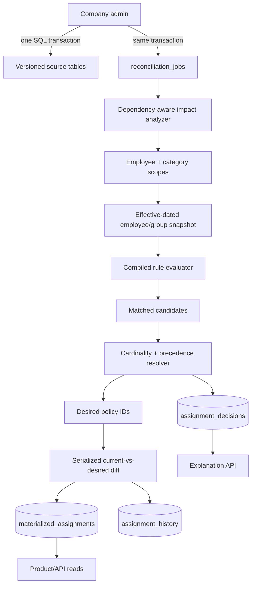
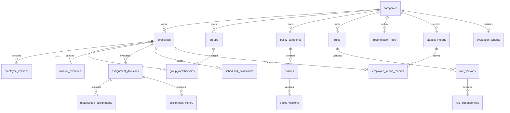
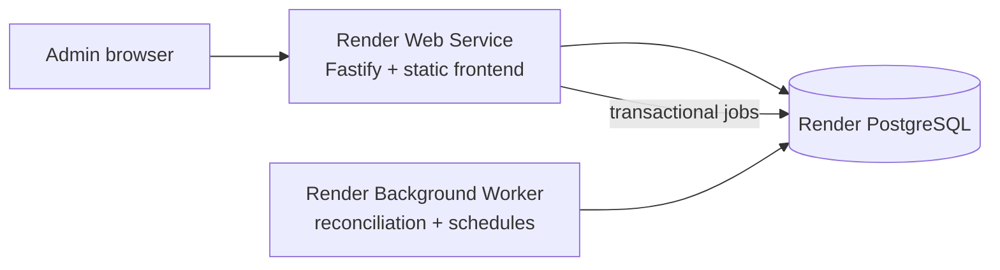

# Architecture

## 1. Problem model

An assignment is a dated decision, not a direct rule-to-employee join. Source facts and configuration produce candidates; category cardinality and precedence produce desired policies; reconciliation materializes the difference. This separation lets the system explain losers, retry safely, preview exactly, and answer dated questions.



This is a modular monolith: API and worker processes use the same domain and service modules against one PostgreSQL database. There is no distributed-message consistency gap and no need for Kafka or Redis.

## 2. Data model



Core facts remain relational. Extensible employee values, the rule AST, snapshots, traces, and candidate sets are JSONB because their shape is deliberately extensible. Every cross-tenant relationship uses `(company_id, id)` foreign keys, so a valid UUID from another company still fails.

Effective data uses UTC `date` and half-open `[valid_from, valid_to)` intervals. GiST exclusion constraints prevent overlapping employee versions and group memberships. A same-day superseded source version may have an empty interval; immutable decision JSON still preserves what a worker actually evaluated. Product semantics intentionally resolve one final state per calendar day.

## 3. Rule representation and compilation

The recursive, Zod-validated AST permits:

- comparison facts: stable employee fields, arbitrary attribute keys, `tenure_days`, and `as_of_date`;
- `EQ`, `NE`, `GT`, `GTE`, `LT`, `LTE`, `IN`, and `NOT_IN`;
- explicit `MEMBER_OF` and `NOT_MEMBER_OF` group nodes;
- `and`, `or`, and `not` nodes.

No string expression is evaluated and no user code is loaded. `compileRule` validates once, canonicalizes and hashes content, constructs dependency metadata, computes specificity, and returns an evaluator. The worker's bounded LRU-style cache keys by immutable rule-version ID and validates the stored content hash to detect illegal mutation.

Traces contain condition path, fact name, actual value, operator, expected value, and match result.

## 4–6. Matching, cardinality, and conflict precedence

A matched rule proposes an `ASSIGN` candidate. Manual controls propose `ASSIGN` or `EXCLUDE`. The resolver first selects the controlling candidate per policy; a winning exclusion vetoes that policy. It then applies category cardinality:

- `SINGLE`: zero or one distinct policy;
- `MULTIPLE`: one winning candidate for every eligible distinct policy.

The stable comparison tuple is:

```text
(manual before rule, priority DESC, specificity DESC, candidate_id ASC, policy_id ASC)
```

Specificity is the number of leaf predicates. It only breaks equal-priority rule ties; admins should use priority for deliberate business precedence. No result depends on SQL row order, object iteration order, or worker timing. Losers store the winner ID and an explicit reason.

## 7. Source-data versioning

- `employee_versions` records effective employee snapshots and changed fields.
- `group_memberships` records dated membership intervals.
- `policy_versions` records name, enabled state, metadata, and effective interval.
- `rule_versions` are immutable `DRAFT`/`PUBLISHED` records; publishing closes the previous effective interval.
- `manual_overrides` retain their interval and revocation timestamp.
- policy/category/rule/employee keys are stable identities; mutable behavior is versioned.

Published historical rule versions remain `PUBLISHED`; `valid_from/valid_to` determines which was active. Historical assignment reads come from `assignment_history`, while explanation reads choose the latest dated decision that still contains the requested winner.

## 8. Reconciliation flow

For an `(employee_id, category_id, as_of_date)` scope:

1. Acquire a transaction-scoped advisory lock derived from employee and category.
2. Load the effective employee version, group set, category, possible rule versions, policy versions, and overrides.
3. Evaluate relevant rules and create candidate traces.
4. Resolve once with the cardinality resolver.
5. Fingerprint every effective input and reuse an identical decision on retry.
6. Lock current materialized rows.
7. Delete only stale policies, close their history, and insert only missing policies/history.
8. Do not update unchanged assignment rows.
9. Replace future temporal schedules for the scope.
10. Commit the decision, diff, history, and schedules atomically.

`slot_key` is category ID for `SINGLE` and policy ID for `MULTIPLE`; a unique `(company, employee, slot_key)` index provides a database backstop against two single-cardinality winners.

The worker loads a job's snapshots, rules, categories, and controls in bounded sets, then reconciles up to 500 scopes per short transaction. Advisory locks are acquired in stable employee/category order. Decisions, current rows, removals, additions, history, and temporal schedules use `jsonb_to_recordset` set operations instead of per-scope SQL. A failed batch rolls back atomically; replay safely reuses decision fingerprints and diffs against committed materialization.

## 9. Impact analysis

`rule_dependencies` indexes every fact/group/time dependency. The impact strategy is conservative: it may include extra work but must never omit an employee who can change.

| Event | Impact selection |
|---|---|
| Employee field/attribute update | Active rule dependencies for only changed keys → distinct categories for that employee |
| Group membership update | Rules depending on that exact group → categories for that employee |
| Rule publish | Union of previous/new categories and their sound mandatory-selector populations |
| Policy version | Current assignees plus selector populations of rules targeting the policy |
| Override or scheduled transition | Exact employee/category |
| Explicit full run | Tenant employee × category cross-product |

A selector is only marked mandatory when logically safe. Predicates inside `AND` are mandatory; for `OR`, only structurally identical selectors present in every branch survive; selectors under `NOT` never narrow impact. Supported equality/`IN` and group selectors use indexed employee versions, JSONB attributes, or memberships. Rules without a sound selector deliberately fall back to all company employees.

Rule updates consider both the old and new selector populations, so employees leaving the selector are reconciled as well as employees entering it.

## 10. Time-triggered reevaluation

The compiled evaluator calculates the next possible truth transition for integer tenure and calendar-date comparisons, including equality's start and end days, plus rule/override boundaries. Reconciliation persists those transitions in `scheduled_evaluations`.

One worker loop claims due schedule rows with `FOR UPDATE SKIP LOCKED`, writes a deduplicated temporal job, and marks the schedule processed in the same transaction. Future-effective employee, membership, rule, policy, and override mutations also set the outbox job's `available_at`, preventing a future employee from being retried before an effective snapshot exists.

## 11. Audit and explanation

`assignment_decisions` is first-class audit data containing:

- employee version and full effective snapshot, including sorted group IDs;
- input fingerprint and evaluation date;
- every matched rule/manual candidate;
- rule version IDs, condition traces, actual/expected values, priority, and specificity;
- winners and rejected candidates with winner references/reasons;
- next temporal transition and source reconciliation job.

Assignment history references the decision that created each interval. Later decisions are retained even when the policy remains unchanged, allowing “why on date Z?” to use the latest effective evidence without rewriting the materialized assignment.

## 12. Preview workflow

Preview compiles the proposed draft, replaces the selected rule identity (or adds a new one), and processes employees in batches of 500. It bulk-loads employee/group snapshots, overrides, and materialized baselines for each batch. Each employee uses the same `PolicyEvaluator` and `resolveCandidates` implementation as reconciliation.

The response reports employees evaluated/affected/unchanged, assignment rows added/removed, employees with replacements, and bounded representative examples. `PREVIEW_MAX_EMPLOYEES` provides an explicit safety limit; exceeding it fails rather than returning an approximate answer.

## 13. Database indexes

Important access paths include:

- tenant/external employee uniqueness and current effective employee fields;
- GiST non-overlap indexes on employee versions, memberships, and assignment history;
- GIN `jsonb_path_ops` on current arbitrary attributes;
- membership indexes in both employee and group direction;
- active rule versions by company/date and rule dependencies by `(company, type, key)`;
- active overrides by employee/date;
- materialized reads by `(company, employee, category)`;
- foreign-key support indexes from materialized assignments to decisions and from decisions to employee versions, preventing retention/reset cascades from degrading into repeated scans;
- explanation decisions by `(company, employee, category, as_of_date DESC)`;
- operational decisions by `(company, decided_at DESC)`, tenant job status, and tenant active-override dates;
- partial job claim and due-schedule indexes.

Selectors compare JSONB values with parameters, and dynamic employee-column selection is restricted to a hardcoded safe map.

## 14–15. Transactional, retry, and concurrency model

Every relevant API mutation and outbox insert share one SQL transaction. Workers atomically claim one pending or expired-lease job with `SKIP LOCKED`, increment attempts, and record ownership. Long jobs renew their lease. Failures store a bounded error, release ownership, and retry with exponential backoff; the final attempt becomes visible `DEAD` state.

Assignment writes use a transaction-scoped advisory lock per employee/category, row locks on current assignments, unique slots, deterministic results, decision fingerprints, and differential inserts/deletes. Duplicate delivery and concurrent jobs therefore converge. No exception is silently converted into a guessed policy.

## 16. Scaling strategy

The first scaling lever is less work: dependency-to-category impact, mandatory rule selectors, compiled rules, materialized reads, and batched preview. Independent jobs run with bounded worker concurrency; PostgreSQL coordinates claims and per-scope serialization. Stateless API/worker replicas can be added against one primary PostgreSQL database. Dedicated evaluation tenants are excluded from unscoped production job claims; a company-scoped evaluation worker exercises the same implementation without racing the normal worker fleet.

For much larger tenants, rule-impact scopes can be emitted as bounded child jobs and historical decision JSON can be time-partitioned without changing domain semantics. The current job bounds its database transactions to 500 scopes and heartbeats between batches, preserving retry safety without one transaction per employee/category.

## 17. Regression evaluation and performance characteristics

The NYC importer fetches exactly 50,000 validated records from dataset `k397-673e`, discards names, and persists normalized facts plus query/fetch/checksum provenance. The offline regression runner builds 300 deterministic evaluation-only rules from observed distributions, establishes materialization through the normal FULL job, and compares it to an independent exhaustive interpreter before mutation testing begins.

At least 100,000 deterministic API mutations then exercise employee facts, tenure/date movement, groups, rules and versions, policy versions, manual assignment/exclusion/revocation, and duplicate job delivery. Ordinary checkpoints recompute every rule for affected employees in the oracle; global and temporal checkpoints compare all 50,000 employees. The report separates correctness counters from measured job latency and rule-evaluation work.

The production path records affected scopes and evaluation counts. Human-readable and machine-readable summaries are generated under `eval-results/`; the latest certified summaries are committed, while large per-batch replay ledgers and failure artifacts remain local. No 50,000-row dump or fabricated benchmark artifact is stored in Git. Performance work is concentrated in dependency filtering, category scopes, immutable compiled-rule caching, per-job bulk loads, 500-scope set-based reconciliation transactions, indexed SQL paths, temporal-job coalescing, and bounded worker concurrency.

The certified 2026-08-31 run used seed `482901`, the 50,000-row import with SHA-256 checksum `dbf4a9c0fea6ddea244a37ef5e6b21901b4fc714826f3f18666162a4cb687eaf`, and an initial 300-rule universe. It verified 100,000 mutations in 201 localized batches and 26 singleton global batches. The independent oracle compared 8,675,538 employee/category assignment sets. Assignment mismatches, impact false negatives, single-cardinality violations, determinism failures, idempotency failures, duplicate active assignments, and tenant-isolation failures were all zero.

Measured reconciliation-job latency was 46.199 ms p50, 582.728 ms p95, and 733.56 ms p99. Localized mutation throughput was 45.784 mutations/second and affected-scope throughput was 316.76 scopes/second. Large rule changes completed in 36,629.193 ms at p95; the measured temporal transition completed in 3,817.65 ms. Incremental processing evaluated 33,550,536 rules versus 421,438,330 equivalent full-rule evaluations, avoiding 92.039% of evaluation work. Mutation verification took 2,779.814 seconds; the entire clean evaluation, including setup, baseline, concurrency calibration, and oracle work, took 3,251.56 seconds.

Concurrency was selected from a measured local calibration: 8 workers processed 643.343 scopes/second, 12 processed 950.057, and 16 processed 858.103, so the certified run used 12. Reconciliation latency excludes deterministic setup/reset/import, baseline materialization, worker calibration, and oracle time. No NYC API request occurs during regression execution.

## Admin product surface

Fastify serves the dependency-light admin application from `/admin/`; it uses the same JSON API as external consumers. The persistent shell maps the product model into Overview, People, Policies, Rules, and Audit. Categories are contained inside Policies and manual controls are contained inside Employee detail. Employee and rule change previews call backend preview services, explanations read immutable decision evidence, and writes flow through the same effective-dated source APIs and transactional jobs as any other client.

The idempotent `seed:product` command creates **NYC Open Data Policy Workspace** by copying the immutable normalized facts in `employee_import_records` into a separate tenant with product-owned employee/version and provenance rows. It invokes the shared `createCertifiedBaseline()` implementation—the same code called by evaluation setup—to create the 6 categories, 48 policies, 300 rules, and observed groups, then drains one company-scoped full job through `ReconciliationWorker`. It never writes materialized assignments directly and never calls the NYC API. `GET /companies` excludes `evaluation_tenants` and orders the isolated product tenant first. UI edits append versions only inside the product tenant, preserving the certified evaluation database and committed artifacts unchanged.

Employee list filtering, status/manager facets, sorting, totals, and pagination are SQL-backed for the 50,000-row tenant. A bounded page CTE is joined once to a grouped assignment count, avoiding both all-row browser rendering and per-employee assignment queries. Trigram search and current-fact filter indexes support product queries. The 300-rule page is also API-paginated with server-side search, category, dependency, and status filters. Detail drawers preserve list context, while native dialogs provide focus trapping for onboarding, impact review, structured rule editing, and exceptional manual controls. The recursive builder expresses the validated AND/OR/NOT/comparison/group AST without arbitrary code. Responsive tables retain every important value as labelled rows. See [UX design](UX_DESIGN.md) for research references and interaction rationale.

## Render topology

The Blueprint keeps the modular-monolith boundary intact:



Both services build the same TypeScript commit. Advisory-lock-protected migrations run as pre-deploy commands, the web service exposes the database-backed `/health` check, and the worker uses bounded concurrency plus PostgreSQL job claiming. PostgreSQL remains the only authoritative state and queue.

## 18. Known tradeoffs

- Effective time is calendar-date, not intra-day. Decision records preserve multiple evaluations, but assignment “as of” semantics return the final state for a day.
- Mutation APIs reject backdated corrections after an identity exists; apply imports before the desired effective date. This avoids silently rewriting already-audited assignment history.
- Exact preview intentionally refuses populations over its configured bound; it does not sample or estimate.
- Rule impact without a logically mandatory selector scans the company's employees. This is required for correctness with `OR`, `NOT`, and pure time rules.
- Rule-impact employee IDs are currently held in memory for one job. Very large tenants should page them into child jobs.
- The dependency-light admin UI avoids a client framework and build pipeline. Its recursive builder supports the complete nested AST, but does not include drag-and-drop condition rearrangement.
- Authentication is outside this submission's scope. Deploy behind an authenticated admin gateway that supplies an authorized company ID; the header alone is not proof of identity.
